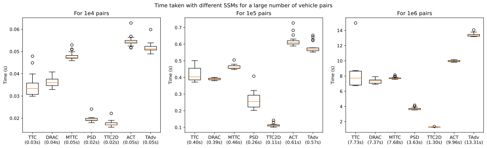

# SSMsOnPlane

This repository shares python scripts for calculating various [surrogate safety measures (SSMs), or in another way called, surrogate measures of safety (SMoS)](https://www.tos.lth.se/english/research/traffic-safety-behaviour/special-expertise/smos/) for pairs of road users on an abstracted plane of road, i.e., in a two-dimensional space. 

Two branches of SSMs are considered: 
- __Longitudinal SSMs__ that are originally designed for one-dimensional (rear-end) conflicts and collisions, but can be extended to two-dimensional space by assuming constant velocities. These include Time-To-Collision (TTC) [^1], Deceleration Rate to Avoid Collision (DRAC), Modified Time-To-Collision (MTTC), and Proportion of Stopping Distance (PSD) in this repository. A previous repo [Two-Dimensional-Time-To-Collision](https://github.com/Yiru-Jiao/Two-Dimensional-Time-To-Collision) is referred to for more details on the vectorised extention.
- __Two-Dimensional SSMs__ that are specifically designed for conflicts and collisions involving both longitudinal and lateral movements. These include Time Advantage (TAdv), Two-Dimensional Time-To-Collision (TTC2D), and Available Collision Time (ACT) in this repository. In addition to the above, a recently proposed indicator, [Emergency Index (EI)](https://doi.org/10.1016/j.trc.2024.104981), is open-sourced by its authors in the linked [repo](https://github.com/AutoChengh/EmergencyIndex).

These metrics/indicators are designed to be used with trajectory data from road users, such as vehicles or cyclists, to assess their interaction safety in a given scenario. The repository also includes helper functions to evaluate the computational efficiency. For references to these indicators, please scroll down to the bottom of this page.

## Overview
The repository is structured as follows:
- **src/**  contains the main Python modules implementing the functions:
  - [`geometry_utils.py`](src/geometry_utils.py) provides geometric helper functions (e.g., `intersect`, `getpoints`, etc.) used to compute distances, intersections, and angles.
  - [`longitudinal_ssms.py`](src/longitudinal_ssms.py) implements longitudinal safety measures including TTC, DRAC, MTTC, and PSD.
  - [`two_dimensional_ssms.py`](src/two_dimensional_ssms.py) provides functions for two-dimensional safety measures including TAdv, TTC2D, and ACT.
  - [`efficiency_utils.py`](src/efficiency_utils.py) contains helper functions to evaluate the computational efficiency of the indicators by timing their execution on sample data.
- **assets/** contains supplementary files such as example data samples extrated from the lane-changes in the [highD](https://www.highd-dataset.com/) dataset and a plot comparing the efficiency of indicators.
- **example.ipynb** a Jupyter Notebook is provided for demonstrating how to load sample data and compute SSMs. It also uses the evaluation functions from [`src/efficiency_utils.py`](src/efficiency_utils.py) and makes the comparison plot.


## Package requirements
Any versions of the following packages should work: `NumPy`, `Pandas`, `Matplotlib` (for plotting in the notebook), and `tqdm` (for progress visualization in the notebook).

## Usage
To compute a safety measure, import the corresponding function and pass in a DataFrame with the required variables.

| Variable : | Explanation                                                                                   |
|------------|-----------------------------------------------------------------------------------------------|
| x_i      : | x coordinate of the ego vehicle (usually assumed to be centroid)                              |
| y_i      : | y coordinate of the ego vehicle (usually assumed to be centroid)                              |
| vx_i     : | x coordinate of the velocity of the ego vehicle                                               |
| vy_i     : | y coordinate of the velocity of the ego vehicle                                               |
| hx_i     : | x coordinate of the heading direction of the ego vehicle                                      |
| hy_i     : | y coordinate of the heading direction of the ego vehicle                                      |
| acc_i    : | acceleration along the heading direction of the ego vehicle (only required if computing MTTC) |
| length_i : | length of the ego vehicle                                                                     |
| width_i  : | width of the ego vehicle                                                                      |
| x_j      : | x coordinate of another vehicle (usually assumed to be centroid)                              |
| y_j      : | y coordinate of another vehicle (usually assumed to be centroid)                              |
| vx_j     : | x coordinate of the velocity of another vehicle                                               |
| vy_j     : | y coordinate of the velocity of another vehicle                                               |
| hx_j     : | x coordinate of the heading direction of another vehicle                                      |
| hy_j     : | y coordinate of the heading direction of another vehicle                                      |
| acc_j    : | acceleration along the heading direction of another vehicle (optional)                        |
| length_j : | length of another vehicle                                                                     |
| width_j  : | width of another vehicle                                                                      |

For instance, to compute the Time-To-Collision (TTC):

```python
import pandas as pd
from src.longitudinal_ssms import TTC

# Create or load your samples
df = pd.read_csv('your_vehicle_data.csv')

results = TTC(df, toreturn='dataframe')
print(results[['TTC']].head())
```

## Efficiency evaluation
The notebook provides a full demonstration of the efficiency evaluation functions. With a range of 1e4, 1e5, and 1e6 pairs of vehicles, below is a comparison plot showing the execution time of each indicator, tested over 20 runs.

<p align="center">
  
</p>

## Notes
- The two road users under evaluation are assumed to never collide if they keep current speed when 
    - indicator value is np.inf if the used indicator is TTC, MTTC, TTC2D, TAdv, or ACT;
    - indicator value is 0 if the used indicator is DRAC.

- When the indicator value is smaller than 0, the bounding boxes of the two road users are overlapping. This is due to approximating the space occupied by an object with a rectangular. In other words, negative indicator in this computation means a collision almost (or although seldom, already) occurred.

- The computation can return extreme small positive values (for TTC/MTTC) or extreme large values (for DRAC) even when the vehivles overlap a bit (so should be negative values). In order to improve the accuracy, please use the function `geometry_utils.CurrentD(samples)` to exclude overlapping vehicles.

## References
[^1]: \[[TTC](https://www.ictct.net/wp-content/uploads/SMoS_Library/LIB_Tarko_2018.pdf)\] Hayward, J., 1972. Near miss determination through use of a scale of danger. 51st Annual Meeting of the Highway Research Board, 384, 24–34.
2. \[[DRAC](https://trid.trb.org/View/66554)\] Cooper, D., Ferguson, N., 1976. Traffic studies at T-junctions – A conflict simulation record. Traffic Engineering and Control, 17 (7), 306–309.
3. \[[MTTC](https://journals.sagepub.com/doi/10.3141/2083-12)\] Ozbay, K., Yang, H., Bartin, B., Mudigonda, S. (2008). Derivation and Validation of New Simulation-Based Surrogate Safety Measure. Transportation Research Record, 2083(1), 105-113.
4. \[[PSD](https://trid.trb.org/View/85806)\] Allen, B., Shin, B., Cooper, P., 1978. Analysis of traffic conflicts and collisions. Transportation Research Record, 667, 67–74.
5. \[[TAdv](https://doi.org/10.1016/j.aap.2010.03.021)\] Laureshyn, A., Svensson, Å., Hydén, C. (2010). Evaluation of traffic safety, based on micro-level behavioural data: Theoretical framework and first implementation. Accident Analysis & Prevention, 42(6), 1637-1646.
6. \[[TTC2D](https://doi.org/10.1016/j.aap.2023.107063)\] Guo, H., Xie, K., Keyvan-Ekbatani, M. (2023). Modeling driver’s evasive behavior during safety–critical lane changes: Two-dimensional time-to-collision and deep reinforcement learning. Accident Analysis & Prevention, 186, 107063.
7. \[[ACT](https://doi.org/10.1016/j.trc.2022.103655)\] Venthuruthiyil, S. P., Chunchu, M. (2022). Anticipated Collision Time (ACT): A two-dimensional surrogate safety indicator for trajectory-based proactive safety assessment. Transportation research part C: emerging technologies, 139, 103655.

## License
(c) 2025 Yiru Jiao (y.jiao-1@tudelft.nl). All rights reserved.

For more details on each function and its underlying accident theory, see the inline documentation in the source code. 
